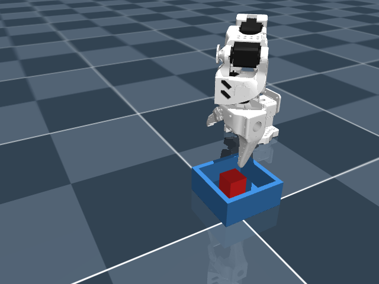
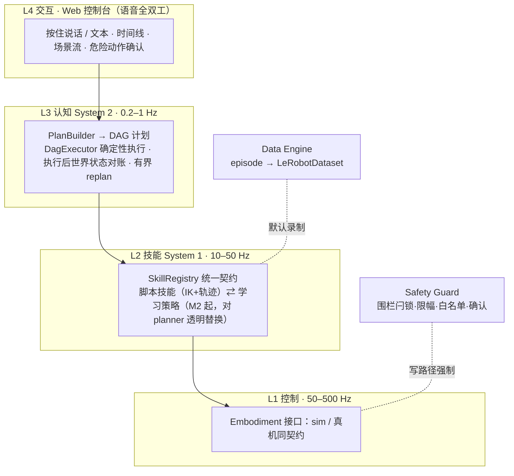

# Embodied Agent

[](https://github.com/SuperdeMan/embodied-agent/actions/workflows/ci.yml)


[Quick Start](#快速开始) ·
[Architecture](docs/architecture.md) ·
[Roadmap](docs/roadmap.md) ·
[Evaluation](eval/) ·
[Design Decisions](docs/decisions.md)

**A safety-bounded, embodiment-agnostic runtime for intelligent robots.**

**跨本体的具身智能体运行时**——「大脑—小脑—本体」分层架构：LLM 负责认知规划（System 2），技能层负责闭环执行（System 1），硬件抽象层隔离本体；安全监督、数据引擎、可观测三条竖切贯穿。桌面操作机器人场景起步，仿真先行、真机跟进（SO-101）。

<p align="center">
  
  <br>
  <em>「把红色方块放进盒子」——语音/文本指令驱动的 see–think–act 闭环（MuJoCo · SO-ARM100）</em>
</p>

## 现在就能跑的（M1 · 仿真闭环）

- **语音/文本 → 规划 → 执行 → 验证 → 汇报**全链路：Web 控制台按住说话或文本下令，LLM 产出结构化计划（DAG of skills），确定性执行器逐步执行并**对账世界状态**（动作完成 ≠ 任务完成：夹取滑落会被如实报告），最终汇报由代码从真实执行结果生成——结构性杜绝「嘴上说做了」。
- **评测有数字**：随机化 pick&place 评测 harness，当前基线**三种子 30/30**；成功与否由仿真真值独立裁判，不信 agent 自报。
- **安全默认在场**：LLM 永不直接触达执行通道；工作区围栏越界即闩锁停机、指令速率限幅、命令来源白名单；危险技能须经用户确认（无确认通道时 fail-closed 拒绝）。
- **数据默认落盘**：每次运行自动产出 episode（观测/动作/语言/成败/安全事件），字段名 1:1 对齐 LeRobotDataset，M2 直接进训练。
- **离线可跑**：不配任何 API key 也能完整体验（确定性离线规划器 + mock 语音），配上 key（Anthropic/DeepSeek/Qwen/MiniMax + DashScope 语音）即切换真实模型，**换模型是配置不是重构**。

## 学习闭环管线（M2 · 进行中）

「采数据→转数据集→训练→部署回系统」全程命令化，学习技能与脚本技能**共用同一 manifest 与同一真值裁判**——替换实现对 planner 完全透明：

```bash
uv run --group sim embodied collect --episodes 60        # 脚本专家采集（录制默认开，含技能边界）
uv run --group sim embodied teleop                       # 或：键盘遥操作人工示教（w/s/a/d/r/f + 空格）
uv run embodied convert --root outputs/collect/... --out outputs/lerobot/pick-v1 \
    --segment skill --skills skill.manip.pick            # → LeRobotDataset v3（社区工具即插即用）
uv run --group learn python scripts/train.py --dataset outputs/lerobot/pick-v1   # 一条命令 ACT 训练
uv run --group learn python scripts/export_onnx.py --checkpoint .../last/pretrained_model \
    --out outputs/policies/pick-v1.onnx                  # checkpoint → 单文件 ONNX（归一化入图+数值校验）
uv run --group sim --group policy embodied sim --task eval/tasks/tabletop_pick_place_v1.yaml \
    --pick-policy outputs/policies/pick-v1.onnx          # 学习技能 vs 脚本技能：同任务同裁判对比
uv run --group sim embodied sim --task eval/tasks/tabletop_pick_place_v1.yaml \
    --perception color                                   # 感知驱动闭环：agent 只见感知，裁判读真值
```

部署侧只需 onnxruntime（零 torch）；训练侧依赖隔离在 `learn` 组（lerobot/torch），CI 不受影响。设计与格式契约见 [decisions.md](docs/decisions.md) D014。

**首个学习策略已出数**（2026-08-07，60 条专家示教、CPU 数小时训练）：同任务同裁判下脚本技能 30/30，学习 pick 29/30，双学习（pick+place 均为策略）29/30——策略替换对 planner 透明，成功与否仍由仿真真值独立裁判。全部数字只增写入 [eval/BASELINES.md](eval/BASELINES.md)。

**感知 v1 已落地**（2026-08-08，[D015](docs/decisions.md)）：`--perception color` 下 agent 全程只见「检测 + 深度反投影」得到的感知物体（多相机后备、可见度门、运动学附着信念；估计误差 ~2mm），评测裁判仍读真值——感知驱动闭环 **30/30**，与真值基线打平。开放词汇检测（Grounding DINO）已接通、本场景鲁棒化进行中。

## 快速开始

需要 Python 3.11+ 与 [uv](https://docs.astral.sh/uv/)。

```bash
git clone https://github.com/SuperdeMan/embodied-agent.git && cd embodied-agent
uv sync --group sim                      # 国内网络加前缀 UV_DEFAULT_INDEX=https://pypi.tuna.tsinghua.edu.cn/simple
uv run python scripts/fetch_assets.py    # 拉取 MuJoCo Menagerie 机械臂模型（一次即可）

uv run --group sim embodied console      # Web 控制台 → http://127.0.0.1:8390（语音+场景+时间线）
uv run --group sim embodied sim          # 终端文本指挥仿真臂
uv run --group sim embodied sim --eval 10 --record   # 跑评测并录制 episodes
uv run embodied chat                     # 无仿真的纯认知环（mock 技能）
```

密钥配置参考 [`.env.example`](.env.example)（全部可选）。

## 架构一图



五层职责、关键契约（SkillManifest / Embodiment / Plan / Episode / Provider 族）、技术选型与失效触发器，见 **[docs/architecture.md](docs/architecture.md)**（单一事实来源）。

## 设计原则

1. **接口高于实现**：LLM、VLA 策略、语音、感知、仿真器、本体全部 provider 化——模型半年一换代，押注可换模型的接口，不押注任何单一模型。
2. **数据一等公民**：录制是运行时默认行为；私有场景数据与版本化评测集是护城河，代码不是。
3. **安全独立通道**：计划-执行分离、执行后验证、独立守护；任何一级都不依赖 AI 输出的正确性。
4. **仿真先行**：一切能力先在 sim 闭环并建立评测基线，再上真机。

## 路线图

| 阶段 | 主题 | 状态 | 一句话退出标准 |
|---|---|---|---|
| M0 | 规范与骨架 | ✅ 2026-08-04 | 文档规范齐备，car-agent 复用移植完成，CI 绿 |
| M1 | 仿真闭环 | ✅ 2026-08-05 | 语音指令完成 pick&place 全链路，运行即产数据；版本化评测基线 30/30；三进程拆分 + 活性链（kill 任一上游进程即闩锁停机） |
| M2 | 学习闭环 | 🚧 主体已通 | 训练→部署一条命令 ✓、感知驱动闭环 30/30 ✓、nightly 评测报告 ✓；余「学习策略不劣于脚本」最后一局（29/30，方差攻坚中） |
| M3 | 真机落地 | ⏳ | SO-101 真机复现仿真闭环，安全防线全部生效 |
| M4 | VLA 与泛化 | ⏳ | 微调 VLA 接管 ≥2 个技能，未见任务组合可测泛化 |
| M5 | 数据飞轮 | ⏳ | 周级「数据→训练→评测→部署」自动循环，第二本体接入 ≤2 周 |

任务拆解与 DoD 见 **[docs/roadmap.md](docs/roadmap.md)**。

## 与 car-agent 的关系

同作者的智能座舱 multi-agent 系统（云-边协同、语音全双工、LLM 规划 + 确定性执行，~4000 测试）。本项目继承其工程资产与安全方法论并泛化到物理本体：多供应商 LLM/语音网关、规划-执行-验证引擎、可观测与权限体系均为移植改造（文件头标注来源，两仓库零运行时依赖）。评估与迁移记录见 **[docs/reuse-from-car-agent.md](docs/reuse-from-car-agent.md)**，技术决策存档见 **[docs/decisions.md](docs/decisions.md)**。

## License

[Apache-2.0](LICENSE)
