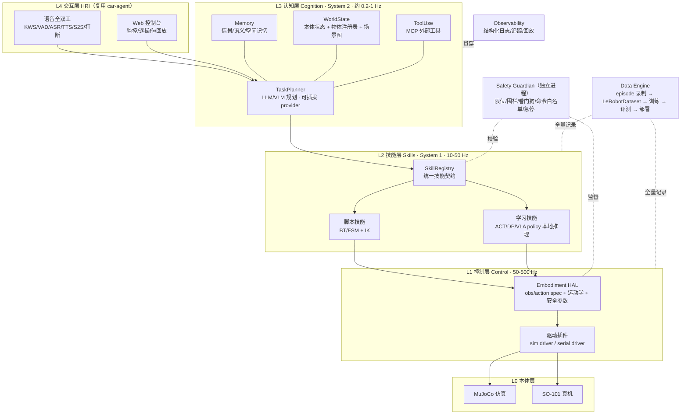
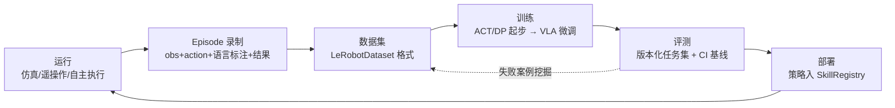

# embodied-agent 架构设计

> 状态：v1.0 已确立（2026-08-04）。本文档是本项目架构的单一事实来源（single source of truth）：实现与本文冲突时，视为实现的 bug 或本文需先行修订。
> 关联文档：[路线图](roadmap.md) · [技术决策记录](decisions.md) · [car-agent 复用评估](reuse-from-car-agent.md)

## 1. 结论（TL;DR）

1. **定位**：把 car-agent 验证过的「LLM 规划 + 确定性执行 + 语音全双工交互」能力，泛化为**跨本体的具身智能体运行时**。初始场景：桌面操作机器人（低成本机械臂 + 语音交互），仿真先行、真机跟进。
2. **架构**：五层「大脑—小脑—本体」分层（HRI 交互 / 认知 System 2 / 技能 System 1 / 控制 HAL / 本体），安全监督、数据引擎、可观测三条竖切贯穿。这与行业收敛方向（Helix、GR00T、π 系列、Gemini Robotics 的双系统架构）同构。
3. **竞争力策略**：不自研基础模型、不自研仿真器、不自研硬件；把可贬值的部分（模型、本体）全部做成可插拔 provider，把不贬值的部分（自有场景数据、评测集、安全与可靠性工程、集成速度）做成私有资产。
4. **复用**：car-agent 约 1.7 万行代码直接挪用（LLM/ASR/TTS 网关、记忆服务、Agent SDK、可观测、语音前端栈），约 7 千行规划-执行引擎改造后复用。其「LLM 只出计划、执行器确定性执行、执行后验证世界状态」的红线对机器人比对汽车更关键，全盘继承。
5. **落地形态**：单机 3 进程起步（agent-core / realtime-control / safety-guardian）+ Web 控制台，不复制 car-agent 的 35 服务微服务拓扑——复用的是模块与契约，不是部署形态。

## 2. 定位与边界

### 2.1 要解决的问题

一个人（或极小团队）如何在 2026-2028 年窗口期内，构建一个**不会因模型/硬件换代而推倒重来**的具身智能体系统，并持续积累别人拿不走的资产（数据、评测、场景 know-how）。

### 2.2 目标

- 同一 Agent 内核，可接入不同本体：仿真臂 → 真实桌面臂（SO-101 级）→ 未来移动底盘/更大平台。
- 换基础模型（LLM planner、VLA policy、语音模型）是配置项，不是重构项。
- 每一次运行（仿真或真机）都自动产出训练级数据；数据格式与开源生态（LeRobotDataset）对齐。
- 安全路径独立于 AI 路径：AI 全错的情况下机器人也不伤人、不自毁。

### 2.3 非目标（不做清单）

| 不做 | 理由 | 重新评估条件 |
|---|---|---|
| 自研 VLA 预训练 | 与 PI/NVIDIA/Google 拼预训练无胜算；开源微调（openpi、GR00T、LeRobot）路线成熟 | 出现个人算力可及的高效预训练范式 |
| 自研仿真器 | MuJoCo/Isaac Lab/Genesis 已足够好且免费 | 不会重估 |
| 自研机器人硬件 | SO-101 级开源硬件 ¥3-4k 可得，宇树等整机快速降价 | 现有硬件无法满足场景且差距是结构性的 |
| 人形本体 | 成本、安全、维护复杂度对 solo 不成立；桌面操作已覆盖数据飞轮验证 | 开源人形整机 < ¥5 万且社区生态成熟 |
| ROS 2 全家桶绑定 | 学习型技能栈不需要；绑定后换代成本高 | 需要接入只有 ROS 驱动的硬件时，以 bridge adapter 方式引入 |
| 多机器人集群调度 | 单体都没跑通，集群是伪需求 | M5 之后按需 |

### 2.4 初始场景选择：桌面操作 + 语音交互

选择理由（对比过的备选：家庭移动服务机器人、纯仿真研究框架）：

- **成本与可行性**：SO-101 约 ¥3-4k，LeRobot 生态有官方 sim2real 支持（NVIDIA Isaac 官方课程）、社区数据集（1200+ 公开数据集、3.8 万+ episodes）、甚至已有开源世界模型（DreamZero-SO101）。solo 可负担、可维修。
- **复用最大化**：座舱 agent 的本质是「固定场景内的多模态交互 + 受约束的动作空间」；桌面具身是它的自然泛化——交互栈几乎原样复用，新增的是操作能力。
- **数据飞轮成立**：桌面 pick/place/整理类任务重复性高、可自动评测，是最容易转起数据循环的场景。
- 纯仿真框架被否决：没有真机数据就没有护城河；移动服务机器人被否决：导航+操作双线作战，solo 带宽不支持。

## 3. 行业现状与设计约束（截至 2026-08）

### 3.1 关键事实

- **双系统架构收敛**：Figure Helix（S1 高频视觉运动策略 + S2 VLM）、NVIDIA GR00T（视觉语言骨干 + DiT 动作头）、π0.5/π0.6 分层推理、Gemini Robotics 2（2026-07，全身人形自主控制 + 多步推理）——行业头部全部收敛到「慢思考规划 + 快系统执行」。
- **模型半年一换代**：π0（2025-02 开源）→ π0.5 → π*0.6 + RECAP（经验强化学习，2025-11）→ π0.7（可引导，泛化跃迁）；GR00T N1 → N1.5 → N1.7 EA（2026-04，3B 开放商用，2 万小时级人类第一视角视频预训练）。**押注任何单一模型都会输，押注可换模型的接口才会赢。**
- **世界模型进入主流**：2026 年「世界模型出仿真、VLA 出动作」的闭环融合成为明确方向（PI 世界模型、DreamZero-SO101 等）；跨本体「一脑多形」成为口号级共识。
- **数据是主战场**：GR00T N1.7 靠人类第一视角视频扩数据；LeRobot 社区数据集规模一年翻数倍；国内 AgiBot World 等百万级 episode 数据集开放。模型权重开放越来越多，**私有场景数据与评测才是稀缺品**。
- **硬件快速平价化**：SO-101（¥3-4k）、宇树 R1（¥3.99 万起）级产品持续下探；国内具身智能被写入政府工作报告后产业链加速。

### 3.2 推导出的五条设计约束

1. **接口高于实现**：Planner、Policy、ASR/TTS、本体、仿真器全部 provider 化，换代 = 换配置 + 适配层，不动内核。
2. **数据一等公民**：录制不是功能，是运行时的默认行为；格式对齐 LeRobotDataset，社区训练/评测工具即插即用。
3. **安全独立通道**：确定性守护不依赖任何模型输出正确性；继承 car-agent「LLM 不直接触达执行通道」红线。
4. **仿真先行**：一切能力先在 sim 闭环并建立评测基线，再上真机；CI 必须能在无硬件环境跑通全链路。
5. **世界模型留座**：世界状态与 episode 表示的设计，要能让世界模型以「动作预演/结果验证」角色接入，而不需要改内核。

## 4. 总体架构



各层职责与频率：

| 层 | 职责 | 典型频率 | 部署位置 |
|---|---|---|---|
| L4 HRI | 语音全双工、控制台、远程接入 | 事件驱动 | agent-core 进程 + 浏览器 |
| L3 认知（System 2） | 任务理解、规划、记忆、场景理解、工具调用、失败反思 | 0.2-1 Hz | agent-core 进程（LLM 走云 API） |
| L2 技能（System 1） | 技能选择后的闭环执行：脚本技能与学习策略 | 10-50 Hz | realtime-control 进程 |
| L1 控制 | 本体抽象、运动学、驱动、插值与限幅 | 50-500 Hz | realtime-control 进程 |
| L0 本体 | 仿真 / 真机 | — | — |
| 安全（竖切） | 独立守护：物理→固件→软件→计划四级 | 100 Hz + 事件 | safety-guardian 进程 |
| 数据（竖切） | 录制、数据集、训练、评测、回流 | 后台 | 后台任务 + 训练工作站 |
| 观测（竖切） | 日志、追踪、指标、回放 | 后台 | 各进程内嵌 + 本地存储 |

### 4.1 L4 交互层（HRI）

直接复用 car-agent 的两档语音架构（见[复用评估](reuse-from-car-agent.md)）：

- **三段式**：KWS（sherpa-onnx WASM 唤醒）→ VAD（silero）→ 流式 ASR → 规划 → 流式 TTS，端点判定权在客户端（car-agent 真机测试踩过的坑，直接继承结论）。
- **S2S 端到端语音**：延续「S2S 会话不含执行通道，唯一工具是 `escalate`」的红线——语音大模型永远不能直接驱动机械臂，只能升级给 planner。这条规则从座舱平移到机器人后安全含义更重。
- 机器人的「脸」初期就是 Web 控制台（浏览器语音栈直接可用）；原生音频（机载麦克风阵列）推迟到真机阶段，用 sherpa-onnx Python 侧实现，VoiceLoop 状态机设计原样平移。

### 4.2 L3 认知层（System 2）

- **TaskPlanner**：继承 car-agent `PlannerEngine/PlanBuilder/DagExecutor/LoopController` 的骨架——LLM 产出结构化计划（DAG of skill invocations），确定性执行器逐步执行，每步做前置条件检查与执行后验证。改造点：计划的叶子节点从「agent 调用」变为「技能调用」。
- **WorldState**：继承 `VehicleStateMirror` 思想，扩展为三部分——本体状态（关节/位姿/夹爪）、物体注册表（感知到的物体及其 3D 位姿、置信度、时间戳）、场景图（物体间空间关系）。所有规划都基于 WorldState 快照，执行后用新快照验证「世界是否真的变了」（继承 `verify.py` 的 `eval_state_match` 契约——这对机器人是刚需：夹取可能滑落，动作完成≠任务完成）。
- **Memory**：复用 car-agent memory 服务（Redis 短期 + pgvector 语义 + 关系图 + 强度衰减），新增空间记忆（「剪刀通常在左边抽屉」）作为语义记忆的结构化子类。失败经验通过反思写回（继承 `reflux.py` 思想），供 planner 检索避坑。
- **感知**：开放词汇检测/分割（Grounding DINO / SAM2 级开源模型）+ 深度相机点云 → 物体位姿。感知模型同样 provider 化。VLM 场景描述作为 planner 的眼睛（图像帧走 `vision_frames` 通道，复用 car-agent 已有实现）。

### 4.3 L2 技能层（System 1）

技能是 LLM 与物理世界之间的**唯一通道**，也是本架构最重要的契约：

```python
class SkillManifest(BaseModel):          # 延续 car-agent manifest.yaml 声明式风格
    name: str                            # skill.<domain>.<action>，如 skill.manip.pick
    params: dict[str, ParamSpec]         # 类型化参数，LLM 按 schema 填槽
    preconditions: list[Predicate]       # 基于 WorldState 的前置条件
    effects: list[Predicate]             # 声明的预期效果，供执行后验证
    termination: TerminationSpec         # 成功/失败/超时判定
    recovery: RecoverySpec               # 失败恢复策略（重试/回退/上报 planner）
    safety: SafetySpec                   # 速度上限、力上限、工作区约束
    require_confirm: bool = False        # 危险动作二次确认，继承 car-agent
    impl: Literal["scripted", "policy"]  # 脚本实现或学习策略实现
```

- **同一契约，两种实现**：脚本技能（IK + 轨迹 + 简单 FSM/行为树）先把场景跑通并产出数据；学习技能（ACT/Diffusion Policy/VLA，ONNX/TensorRT 本地推理）在数据充足后**逐个替换**脚本技能——替换过程对 planner 完全透明。这是「今天能跑、明天能学」的关键设计。
- **新增技能不改内核**：声明 manifest 即注册（car-agent「加 Agent 不动编排核心」规则的平移），并用契约测试钉死。
- VLA 时代的适配：当接入 π/GR00T 类多任务 VLA 时，一个 policy 背后可承载多个 manifest（语言条件化技能），SkillRegistry 负责路由——契约不变。

### 4.4 L1 控制层（HAL）

本体无关性的根：

```python
class Embodiment(Protocol):
    def spec(self) -> EmbodimentSpec        # 关节数/限位/observation spec/action spec/坐标系
    def model(self) -> Path                 # MJCF/URDF 模型文件
    def read(self) -> Observation           # 关节态 + 传感器，带时间戳
    def write(self, cmd: ActionCommand)     # 经限幅/插值后的动作指令
    def safety_params(self) -> SafetyParams # 速度/力矩/工作区默认约束
```

- 仿真本体（MuJoCo driver）与真机本体（Feetech 串口 driver）实现同一接口；上层全部代码 sim/real 无感，这是 sim2real 与未来换本体的基础。
- 运动学/逆解用现成库（MuJoCo 自带 + mink 级 IK），不自研。
- 控制进程与认知进程分离：认知层卡顿（LLM 延迟、GC）不能影响控制环。

### 4.5 Safety Guardian（安全竖切）

四级防线，上层失效由下层兜底，**任何一级都不信任 AI 输出**：

| 级 | 防线 | 实现 |
|---|---|---|
| SG-0 物理 | 急停按钮、限力硬件（SO-101 小力矩天然安全）、供电切断 | 硬件 |
| SG-1 固件/驱动 | 关节限位、速度/加速度 clamp、电流/温度监控 | driver 内强制 |
| SG-2 确定性守护 | 工作区几何围栏、碰撞盒预检、命令 schema 白名单、心跳看门狗（丢失→halt）、速率限制 | safety-guardian 独立进程，100 Hz |
| SG-3 计划层 | `require_confirm` 二次确认、permission scopes、执行后世界状态验证 | 继承 car-agent 权限引擎与执行器 |

配套继承：prompt 注入防御、内容审核、隐私最小化（`context_scopes` 声明制）。真机阶段的操作纪律（急停在手边、首跑降速等）在 CLAUDE.md 中作为工程红线固化。

### 4.6 Data Engine（数据竖切）



- **录制是默认行为**：每次运行自动产出 episode（观测、动作、语言指令、技能调用序列、成败结果、安全事件），失败数据显式标记——失败数据对 RL 类方法（π*0.6/RECAP 已验证方向）是资产不是垃圾。
- **格式对齐 LeRobotDataset**：直接换来社区的训练脚本、可视化工具、基线策略与共享数据集；自建仅一层 episode 元数据扩展（任务语义、安全事件、planner 决策链）。
- 评测集与数据集同等版本化管理；每个学习技能上线前必须过 sim 评测基线（car-agent golden-gate 纪律平移）。

### 4.7 Observability（观测竖切）

复用 car-agent observability（结构化日志、OTel 追踪、事件采集器），简化传输：起步阶段进程内直写本地 SQLite/文件，不引入 NATS；控制台提供 episode 时间线回放（对机器人调试，回放 = 生命线）。

## 5. 关键接口契约汇总

| 契约 | 作用 | 来源 |
|---|---|---|
| `Embodiment` | 本体无关性；sim/real 同接口 | 新建（对标 car-agent VAL 的抽象位置） |
| `SkillManifest` | LLM 触达物理世界的唯一通道；安全与可组合性的边界 | 改造自 car-agent AgentManifest |
| `Plan/Step/Verification` | 规划-执行-验证分离 | 移植 car-agent orchestrator/cloud |
| Episode schema | 数据资产的原子单位 | LeRobotDataset + 元数据扩展 |
| Provider 族 | LLM/VLM/ASR/TTS/S2S/Policy/感知/仿真全部可插拔 | 移植 car-agent providers 体系并扩展 Policy/Perception |
| 进程间通信 | agent-core ↔ realtime-control ↔ safety-guardian | gRPC（延续 car-agent proto 先行纪律），进程内 asyncio 事件总线 |

## 6. 部署形态

```
┌─ 工作站/PC ────────────────────────────────────────────┐
│  agent-core（L3/L4：规划、记忆、语音服务端、控制台后端） │
│  realtime-control（L1/L2：控制环、技能执行、策略推理）   │
│  safety-guardian（SG-2：独立守护进程）                  │
│  console（浏览器：语音前端、监控、遥操作、回放）          │
└───────┬───────────────────────┬───────────────────────┘
        │ 云 API                 │ USB/串口 或 仿真
   LLM/VLM/ASR/TTS         SO-101 / MuJoCo
```

- **单机三进程起步**，不是微服务：car-agent 的 35 服务拓扑服务于「云-边-多车」形态，机器人是「单机-云」形态。复用其模块与契约，以库方式内嵌，进程边界只保留在实时性与安全要求处。
- **云边分工**：System 2 的重活（LLM/VLM）走云 API；System 1 全部本地（策略推理 ONNX Runtime/TensorRT）。断网降级：已学技能照常执行、本地小模型兜底对话，规划降级为受限指令集。
- 训练在本地 GPU 工作站或按需云 GPU；未来移动真机的机载算力（Jetson 级）留在 M5 评估。

## 7. 技术选型

| 领域 | 选型 | 理由 | 替换成本 |
|---|---|---|---|
| 语言/运行时 | Python 3.11+，uv 管理 | 机器人学习生态全在 Python；uv 解决 car-agent 时代裸 pip 之痛 | 低（HAL 下探 C++/Rust 已留接口位） |
| 仿真 | MuJoCo 起步；Isaac Lab 作为规模化升级项 | 轻量免费、SO-101 现成模型（Menagerie/LeRobot）、CPU 可跑 CI；Isaac 有 NVIDIA 官方 SO-101 sim2real 路线 | 中（SimProvider 隔离） |
| 数据/训练 | LeRobot（数据格式、teleop、ACT/DP/SmolVLA 基线） | 社区最大公约数：1200+ 公开数据集、工具链完整 | 低（格式即协议） |
| VLA 微调 | openpi（π0/π0.5 系）优先，GR00T N1.7（开放商用）备选 | 两条最活跃的开源微调路线，本项目只做 LoRA/后训练级投入 | 低（PolicyProvider 隔离） |
| LLM planner | 复用 car-agent providers.py：Anthropic + OpenAI 兼容（DeepSeek/Qwen/MiniMax） | 已验证的多供应商热切换/降级/限流/缓存 | 已是抽象层 |
| 感知 | Grounding DINO + SAM2 级开源检测分割 + RGB-D | 开放词汇、免训练起步 | 低（PerceptionProvider） |
| 语音 | 复用 car-agent 全栈（DashScope/MiniMax/MiMo + sherpa-onnx + silero） | 1.7 万行成熟资产，双档可切 | 已是抽象层 |
| 策略推理 | PyTorch 训练 → ONNX Runtime 部署，TensorRT 后备 | 延续 car-agent 边缘 NLU 的技术栈经验 | 低 |
| IPC | gRPC + proto 先行；进程内 asyncio 总线 | 延续 car-agent 纪律；proto 部分直接复用 | 低 |
| 存储 | SQLite（观测/episode 索引）+ Redis（会话，可选）+ pgvector（记忆，随 memory 服务） | 单机优先，能不起服务就不起 | 低 |
| 真机第一站 | LeRobot SO-101（单臂起步，预算允许则 leader-follower 双臂遥操作套装） | 生态最厚的低成本选择：官方 sim2real 课程、社区数据、开源世界模型（DreamZero-SO101） | 中（Embodiment 隔离） |

## 8. 竞争力论证与失效触发器

### 8.1 为什么这个架构在未来有竞争力

一个 solo 项目的「竞争力」不是打败 Figure/智元，而是：**(a) 架构换代成本趋近于零；(b) 积累随时间复利、且别人拿不走的资产；(c) 在垂直场景的集成速度快过大厂的通用节奏。**

1. **换代成本≈0**：模型层（planner/policy/语音/感知）全部 provider 化，S2/S1 边界与行业收敛方向同构——π、GR00T、Gemini Robotics 类模型每次升级，本架构都是受益者而非受害者。
2. **数据与评测复利**：格式对齐社区、录制默认开启、失败数据入库。两年后最值钱的不是代码，是「自有场景下带语言标注与成败标记的 episode 库 + 版本化评测集」。
3. **本体无关**：硬件价格战的红利收割位。SO-101 → 更强的臂 → 移动平台，Embodiment 接口保证接入是周级工作。
4. **安全与可靠性工程**：从 car-agent 继承的「计划-执行分离、执行后验证、独立守护、契约测试钉死红线」体系，是 demo 型开源项目普遍缺失的，也是任何真实部署（家庭/教育/轻商用）的准入条件。
5. **起点优势**：1.7 万行直接复用 + 7 千行改造复用 + 一整套已验证的工程方法论（proto 先行、manifest 声明式扩展、golden-gate 评测纪律），起步即领先从零项目数月。

### 8.2 失效触发器（诚实清单：什么情况下上述判断作废）

| 触发器 | 影响 | 应对 |
|---|---|---|
| 端到端「语音+视觉+全身动作」单模型 API 化且延迟/成本可用（Gemini Robotics 2 方向） | S2/S1 分层的规划部分贬值 | 架构退化为「该模型的安全外壳 + 数据引擎」，Safety Guardian 与数据资产价值不降反升 |
| 世界模型推理成本降到准实时 | 当前「验证者」角色定位过时 | WorldState/episode 设计已预留：世界模型升级为规划核心，接口位不变 |
| LeRobotDataset 格式被生态抛弃 | 数据资产迁移成本 | episode 元数据层版本化，写转换器而非重录 |
| SO-101 生态衰退或出现碾压级低价平台 | 硬件路线调整 | Embodiment 接口下换本体是周级工作，数据大部分可迁移（跨本体训练已是行业方向） |
| SOTA VLA 规模膨胀到个人算力无法微调 | 本地微调路线受阻 | 转向托管微调/API 化 VLA + 本地小策略混合，SkillRegistry 路由不变 |

触发器每季度随技术雷达复查一次（机制见[路线图](roadmap.md)）。

## 9. 风险

| 风险 | 等级 | 缓解 |
|---|---|---|
| solo 带宽不足，战线过长 | 高 | 复用最大化；每阶段一个最小 DoD；严格执行不做清单 |
| sim2real gap 大于预期 | 中 | 相机/标定优先投入；域随机化；NVIDIA 官方 SO-101 sim2real 路线兜底 |
| 云 LLM 延迟/成本影响体验 | 中 | provider 降级链（fast tier）；技能层不依赖云；缓存复用 car-agent 实现 |
| 真机损耗与供应链 | 低 | SO-101 备件便宜；双臂套装含冗余 |
| 安全事故 | 低（桌面小力矩） | 四级防线；真机纪律入 CLAUDE.md 红线 |
| 技术判断过时 | 必然发生 | 失效触发器 + 季度技术雷达，把「过时」变成计划内事件 |

## 10. 目录结构规划

以下结构在 M0 代码落地时创建（当前仓库为文档阶段），此处为规范定义，CLAUDE.md 引用本节：

```
embodied-agent/
├── CLAUDE.md                # 项目规则（约束先行）
├── README.md
├── docs/                    # 设计文档（本目录）
│   ├── architecture.md      # 本文档：架构单一事实来源
│   ├── roadmap.md           # 路线图与阶段 DoD
│   ├── decisions.md         # 技术决策记录（只增不改）
│   └── reuse-from-car-agent.md
├── proto/                   # 进程间契约，proto 先行（M0）
├── src/embodied/            # 单包多子模块，不搞微服务仓库
│   ├── hri/                 # L4：语音服务端、控制台后端
│   ├── cognition/           # L3：planner/memory/world_state/perception/tools
│   ├── skills/              # L2：registry + scripted/ + policies/
│   ├── control/             # L1：hal/ + drivers/（sim、feetech）+ kinematics
│   ├── safety/              # SG-2 守护进程
│   ├── data_engine/         # 录制/数据集/训练入口/评测
│   ├── providers/           # LLM/ASR/TTS/S2S/Policy/Perception provider 族
│   └── runtime/             # 共享运行时（日志/追踪/gRPC 工厂/配置）
├── console/                 # Web 控制台（复用 car-agent HMI 语音栈）
├── assets/                  # MJCF/URDF/场景；权重与数据集只放指针不进 git
├── sim/                     # 仿真场景与任务定义
├── eval/                    # 版本化评测任务集与基线记录
├── experiments/             # 一次性实验，可清理，禁止被 src 依赖
└── scripts/                 # 工具脚本（codegen/训练/评测运行器）
```

## 参考（2026-08 检索）

- [Physical Intelligence 博客](https://www.pi.website/blog)（π0.5/π*0.6+RECAP/π0.7 演进）· [π0.6 Model Card](https://website.pi-asset.com/pi06star/PI06_model_card.pdf) · [π*0.6 与 RECAP 解读](https://federicosarrocco.com/blog/pi-star-06-recap)
- [Gemini Robotics 2（2026-07，Bloomberg）](https://www.bloomberg.com/news/articles/2026-07-30/google-unveils-gemini-ai-for-robots-struggling-with-dexterity) · [A3 行业解读](https://www.automate.org/ai/industry-insights/google-deepmind-announces-gemini-robotics-2-new-safety-measures-for-humanoids/aph)
- [2026 年物理 AI 模型盘点（含 GR00T N1.7 EA）](https://www.marktechpost.com/2026/04/28/top-10-physical-ai-models-powering-real-world-robots-in-2026/)
- [LeRobot 库论文（2026-02）](https://arxiv.org/abs/2602.22818) · [NVIDIA 官方 SO-101 sim2real 课程](https://docs.nvidia.com/learning/physical-ai/sim-to-real-so-101/latest/04-lerobot.html) · [DreamZero-SO101 开源世界模型](https://vizuara-ai-lab.github.io/dreamzero-so101/index.html)
- [2026 具身智能模型与世界模型综述（中文）](https://blog.csdn.net/weixin_40970718/article/details/160377599) · [中国人工智能系列白皮书——具身智能（2026 版）](https://www.cdut.edu.cn/__local/4/3B/E7/78B6009E7CAD560FED5DF338682_D42B373F_9EE594.pdf)
